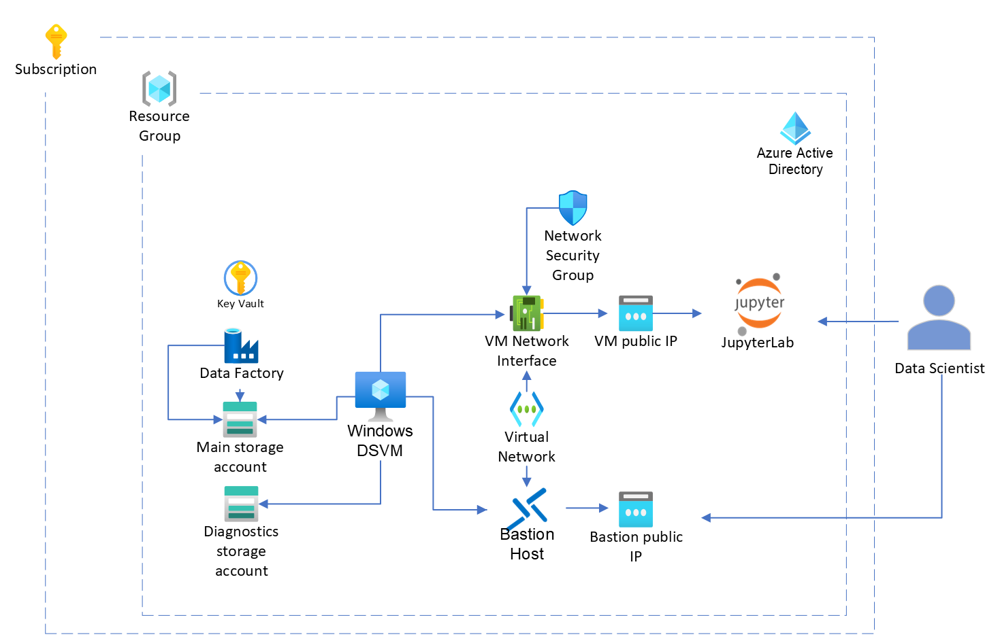

# Introduction

This directory contains the infrastructure as code files to deploy a base Windows Data Science environment in Azure. Please read thru this file to lear how to deploy.

This diagram shows the infrastructure and services you will deploy:



# Pre-Deployment

To ensure a smooth deployment, there are a few things to check:

- Ensure the following provider is registered, if not, please register it: Microsoft.Compute 
- Ensure the role 'Application developer' is assigned to who will perform the deployment.
- Ensure there is quota available for the desired vm size, in the region where you wish to deploy resources.
- If you wish to assign this compute resource to a specific person, ensure that person has an Active Directory user.


# Deployment

[Open](https://shell.azure.com/) a Cloud Shell terminal window in the Azure Portal. Initialize it as bash.

1. Download the deployment files by running:

```
wget https://dsarchitectures3f4g5.blob.core.windows.net/generated-templates/Windows.zip -O deploy-scripts.zip
```

2. Unzip the file

```
unzip deploy-scripts.zip
```

3. Run the deploy.sh file, update the values in the sample script bellow with your values for subscription id, tenant id, etc.

```
TENANT_ID='yourTenantId' SUBSCRIPTION_ID='yourSubscriptionId' PREFIX='terr10' VM_SIZE='Standard_NC6s_v2' LOCATION='eastus' USER_ID='theDeployersObjectId' bash deploy.sh
```

### Parameters explanation

|Required|Name|Description|Default|
|-|-|-|-|
|✓|TENANT_ID|Azure Active Directory Tenant Id|*none*|
|✓|SUBSCRIPTION_ID|The target Azure Subscription id.|*none*|
|✓|PREFIX|A unique prefix for resources.|*none*|
||USER_ID|Active Directory Object Id of user to be added as the default admin of the VM|*none*|
||VM_SIZE|Azure VM Sku|Standard_D4s_v3|
||LOCATION|Location of the resources|eastus|
||USER_ID|This is the deployer's object id, can be fetched from the Azure Portal. Must have permissions to write to Key Vault|*none*|
||RESOURCE_ADMIN_USERNAME|This is the VM username that will be created for the VM|jhubadmin|
||QUIET|True or False - sets deployment to non-interactive.|False|
||AUTHORIZED_IP|IPv4 address to allow inbound traffic to resources|Host machine IPv4|

- You can specify a username, we will generate and output a password for you at the end of the script.

- You can get the subscription, user and tenant ids from the Azure portal. Use the top search bar to find 'Subscriptions' and 'Azure Active Directory' to get the values for subscription id and tenant id, respectively. To get the user id, search for your email in the top search bar. You want to get the Object ID value.

- The prefix should be between 2-17 characters, no special characters and must start with a letter.

- You can run this script in the Cloud Shell to see the available vm sizes by region. Change 'westus' to be whatever region you want to deploy to.

```
az vm list-sizes -l westus -o tsv
```


# Maintenance
The following maintenance tasks are outlined in this document:

1. [Add a new ssh user](#Add-a-new-ssh-user)
1. [Add a new JupyterHub admin](#Add-a-new-JupyterHub-admin)
1. [Add a new VM ssh admin](#Add-a-new-VM-admin)
1. [Revoke SSL certificate](#Revoke-SSL-certificate)
1. [Uninstall resources](#Uninstall-resources)

### Add a new ssh user

1. Add the user to the **Virtual Machine User Login** role for the VM resource in the Azure portal.

### Add a new JupyterHub admin
Perform the following steps to grant admin access to a JupyterHub user:

1. Connect to the VM via SSH as a user with admin permissions.
2. Edit the [/etc/jupyter/jupyterhub_config.py](../multi-user-process-jhub/etc/jupyterhub/jupyterhub_config.py) file on the VM and add the user's normalized (refer to the function `normalize_username` for the normalization rules) display name to the `c.Authenticator.admin_users` property.<br /><br />Alternatively, you can add the user via the JupyterHub Admin control panel.

### Add a new VM admin

1. Add the user to the **Virtual Machine Admin Login** role for the VM resource in the Azure portal.

### Revoke SSL certificate
There may be multiple reasons you need to revoke the SSL certificate.

If you manually installed an SSL certificate after the deployment process you will need to refer to your own internal documentation for the process regarding the removal of an SSL certificate.

If you acquired an SSL certificate as part of the installation process, the easiest way to revoke and remove the SSL certificate is to perform the following steps:

1. Connect to the VM via SSH as a user with admin rights.
1. Ensure the `revoke-cert.sh` script is present in the `/usr/bin` folder.
1. Add execution permissions to the `revoke-cert.sh` script with the command `sudo chmod 700 /usr/bin/revoke-cert.sh`.
1. Execute the `revoke-cert.sh` script with the command `sudo /usr/bin/revoke-cert.sh`.
1. Answer `yes` to the prompt when asked if you want to delete the cert(s) you just revoked.
1. You should see output similar to the following:

```sh
Saving debug log to /var/log/letsencrypt/letsencrypt.log
Starting new HTTPS connection (1): acme-v02.api.letsencrypt.org

- - - - - - - - - - - - - - - - - - - - - - - - - - - - - - - - - - - - - - - -
Would you like to delete the cert(s) you just revoked, along with all earlier
and later versions of the cert?
- - - - - - - - - - - - - - - - - - - - - - - - - - - - - - - - - - - - - - - -
(Y)es (recommended)/(N)o: Y

- - - - - - - - - - - - - - - - - - - - - - - - - - - - - - - - - - - - - - - -
Deleted all files relating to certificate
cdrejkncwusjhubvm01.westus2.cloudapp.azure.com.
- - - - - - - - - - - - - - - - - - - - - - - - - - - - - - - - - - - - - - - -

- - - - - - - - - - - - - - - - - - - - - - - - - - - - - - - - - - - - - - - -
Congratulations! You have successfully revoked the certificate that was located
at
/etc/letsencrypt/live/cdrejkncwusjhubvm01.westus2.cloudapp.azure.com/fullchain.pem

- - - - - - - - - - - - - - - - - - - - - - - - - - - - - - - - - - - - - - - -
```

### Renew SSL Certificate

1. Connect to the VM via SSH as a user with admin rights.
1. Execute the following command:

```sh
sudo certbot renew && sudo systemctl restart jupyterhub
```

## Troubleshooting

### Troubleshooting Jupyterhub service

1. To troubleshoot Jupyterhub service run the below command to check the logs:

```sh
sudo journalctl -r -u jupyterhub
```
